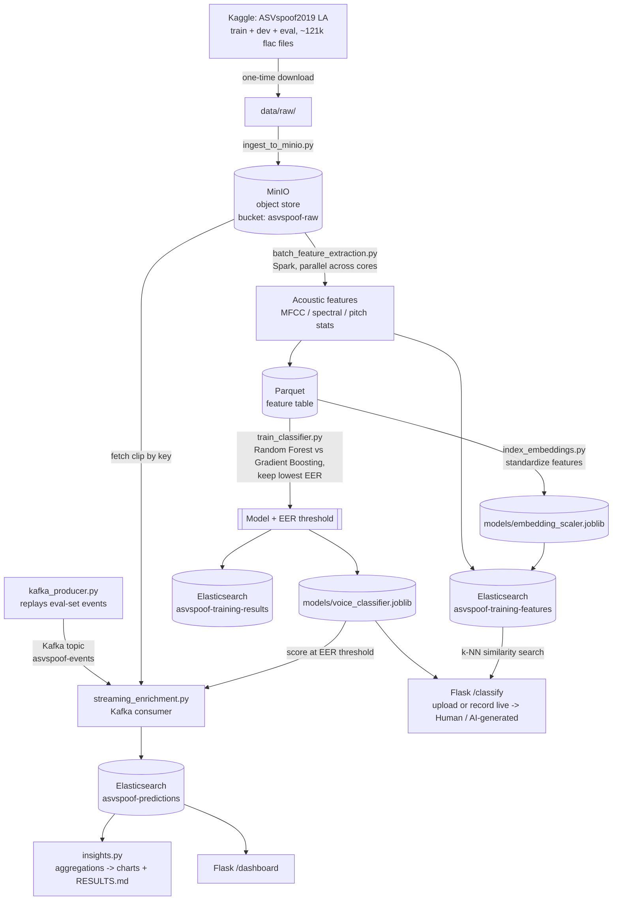

# Design document — Human-or-AI Voice Detector

BIU Big Data and AI course project. Dataset: [ASVspoof2019](https://www.kaggle.com/datasets/awsaf49/asvpoof-2019-dataset)
(Logical Access partition) — real human speech vs. text-to-speech / voice-conversion
synthetic speech.

## Architecture

## Data flow

1. **Ingest (object store).** The raw ASVspoof2019 LA flac corpus is uploaded to MinIO,
   an S3-compatible object store, keyed by partition and filename. Protocol metadata
   (speaker id, attack id, bonafide/spoof label) stays in small local text files —
   only the audio bytes, the actually "big" unstructured data, go into the object store.
2. **Transform (Spark).** A PySpark batch job lists the labeled train+dev utterances,
   fans out across partitions, and for each one fetches the clip from MinIO and computes
   a fixed-length acoustic feature vector (20 MFCC coefficients + spectral/pitch/energy
   statistics). This is the actual "big data" step — parallelizing feature extraction
   across tens of thousands of audio files instead of a single-threaded loop.
3. **Load.** The feature table is written to Parquet (input to training) and to
   Elasticsearch (`asvspoof-training-features`), a NoSQL document store, for ad-hoc
   querying/aggregation.
4. **AI capability — training + model selection.** Two classifiers (Random Forest,
   Gradient Boosting) are trained on the train partition and validated on the dev
   partition (the dataset's own speaker-disjoint split, not a random split — see
   EXPLANATION.md for why that matters for anti-spoofing). The one with the lower
   EER is kept, bundled together with its own EER-optimal decision threshold (not
   the default 0.5 — see EXPLANATION.md's accuracy-paradox discussion for why that
   matters), and saved as one model artifact. Both models' full metrics and the
   trade-off table are saved to `docs/model_comparison.json`.
5. **AI capability — semantic search.** The same standardized feature vectors are
   indexed into Elasticsearch as `dense_vector` embeddings (`index_embeddings.py`),
   enabling k-NN "find acoustically similar clips" search instead of a keyword match.
6. **AI capability — streaming enrichment.** A Kafka producer replays eval-set utterance
   events (metadata only — a MinIO key, not raw audio) onto a topic, simulating new
   audio arriving. A consumer scores each event with the already-trained model (at its
   stored threshold) in near-real-time and writes an enriched prediction document
   (prediction, confidence, correctness against the known label) to Elasticsearch.
7. **Insights.** `insights.py` runs Elasticsearch aggregations — detection accuracy
   overall and per attack type (A01-A19), a confusion matrix, class balance — and
   writes both a markdown report and the charts the dashboard displays.
8. **Serving.** A Flask app exposes `/classify` (upload a clip *or record one live
   from the microphone*, get scored by the exact same feature-extraction + model
   code as the pipeline, plus the 5 most similar training clips via k-NN search,
   each one **playable in the browser** via `/audio/<key>`, which streams the clip
   straight out of MinIO) and `/dashboard` (insights queried live from
   Elasticsearch: a model-comparison table, a deployed-threshold-vs-default-threshold
   comparison table, and six charts — accuracy by attack, class balance, ROC curve,
   feature importance, confusion matrix, confidence calibration).

## Technologies used

| Technology | Role | Course topic |
|---|---|---|
| MinIO | Object store for the raw audio corpus | Object store (S3-compatible) |
| Apache Kafka (KRaft mode) | Event stream simulating incoming audio | Streaming technology |
| Apache Spark (PySpark, local mode) | Parallel batch feature extraction | Apache Spark / batch processing |
| Elasticsearch | Document store for features/results/predictions, aggregations, **and dense_vector k-NN similarity search** | NoSQL database |
| Docker Compose | Runs MinIO + Kafka + Elasticsearch as containers | Containers and virtualization |
| scikit-learn | Random Forest vs. Gradient Boosting classifier comparison (the AI capability) | ML/predictive analytics (brief §6.2f) |
| Flask | Demo web app, including live in-browser microphone recording (Web Audio API, no external libs) | RESTful APIs |

## AI capability

Three related capabilities from the course brief, all sharing one feature-extraction
implementation rather than three disconnected demos:

- **Category (f) — Machine learning and predictive analytics.** Two classifiers are
  trained and compared on acoustic features to distinguish bonafide (human) from
  spoofed (AI-generated: TTS/voice-conversion) speech; the better one (by EER, the
  metric the actual ASVspoof challenge is scored on) is deployed at its own
  EER-optimal decision threshold rather than scikit-learn's default 0.5 — a real fix
  for a real problem this project found (see `docs/EXPLANATION.md`'s accuracy-paradox
  section), not just a theoretical concern.
- **Category (e)-style streaming.** The deployed model is applied to each utterance
  as it "arrives" via Kafka, enriching it with a prediction and confidence score
  written to Elasticsearch in near-real-time.
- **Category (b) — Embeddings and semantic search.** The same standardized feature
  vectors back an Elasticsearch k-NN "acoustically similar clips" search, surfaced
  in the web app's classify results.

The same trained model and embedding space also back the web app's live classify
endpoint (including live microphone recording). See `docs/EXPLANATION.md` for the
full walkthrough of every component, and `docs/RESULTS.md` for the actual numbers.

## Key trade-offs

- **Python end-to-end, not Scala.** Spark's native language is Scala, but the audio
  feature-extraction library (librosa) is Python-only — a Scala job would still need
  to shell out to Python per partition, adding ceremony with no performance gain.
  One language end-to-end also means every stage is easy to read and defend in Q&A.
- **Plain Kafka consumer, not Spark Structured Streaming, for the enrichment step.**
  Spark's real "big data" role here is the parallelized batch feature extraction over
  tens of thousands of files; routing the comparatively light per-message scoring
  through a second Spark job would only add a heavyweight, Maven-resolved connector
  dependency for no real benefit.
- **Spark runs in local mode**, not a multi-node cluster — appropriate for a laptop-scale
  course project and far simpler to demo and debug.
- **Only the LA (Logical Access) partition is used**, not PA (Physical Access/replay
  attacks) — PA spoofing is a person replaying a recording, not AI-generated speech,
  so it doesn't fit the "human-or-AI" framing.
- **The EER-optimal threshold trades some spoof recall for bonafide recall, and that
  trade-off is reported, not hidden.** The original single-model pipeline (Random
  Forest only, default 0.5 threshold) recovered just 28% of bonafide recall on
  dev; the deployed model (Gradient Boosting, chosen by EER) reaches 91% at its
  own EER threshold — part of that gain is a better-calibrated model, part is the
  threshold fix itself (see `docs/EXPLANATION.md` for the full breakdown by
  model). Independently confirmed on live streamed eval data. A handful of
  harder attack types score worse under the new threshold than the old one did.
  There is no threshold that maximizes both classes' accuracy simultaneously on
  an imbalanced problem — EER is a principled choice of *which* trade-off to
  operate at, not a
  free win.
- **The embedding is the classifier's own standardized feature vector, not a
  separate pretrained audio embedding model.** This keeps the "embeddings and
  semantic search" capability fully self-contained and understandable — no extra
  model to explain — at the cost of a less semantically rich embedding space than,
  say, a neural speaker/content embedding would give.
